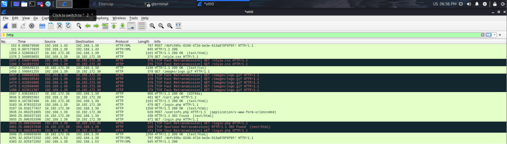
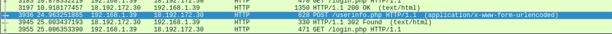
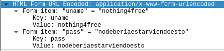
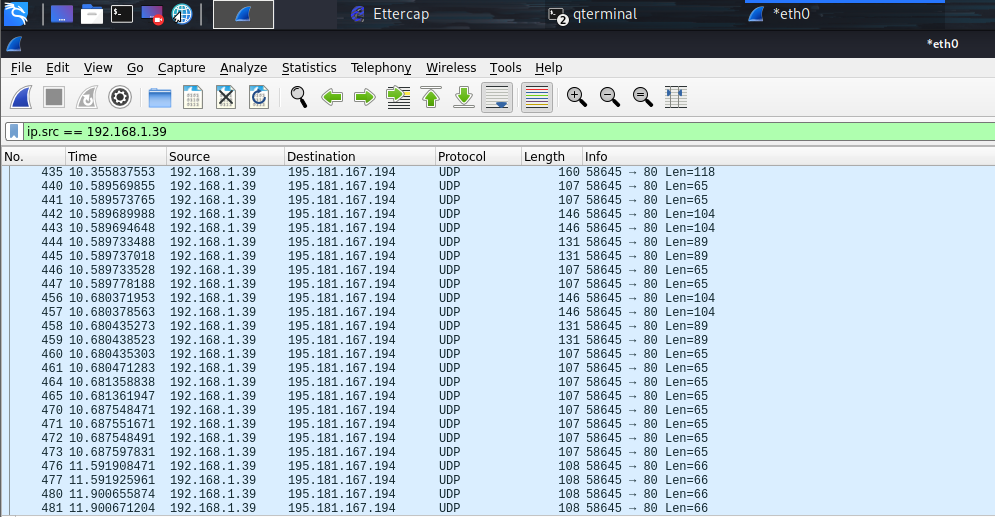

# Protección online: redes públicas y VPN.

Hoy día, raro es el restaurante, aeropuerto u hotel que no dispone de WiFi gratis, y con razón: para la mayoría de personas, tener acceso a Internet gratuito supone una gran comodidad, ya sea por restricciones en sus planes de datos móviles o roaming, o por cualquier otro motivo. Por otro lado, para los ciberdelincuentes, las redes públicas como estas son un objetivo muy fácil, pues pueden tomar control sobre cualquier conexión y robar datos, falsificar páginas web… Por supuesto, hay una forma de protegerse frente a este tipo de ataques: las **VPN**.

### ¿Qué es una VPN?

VPN son las siglas de **_Virtual Private Network_**, lo que viene a ser una **conexión privada y protegida** a un servidor seguro. Cuando nos conectamos a una VPN, todo el tráfico se encripta y pasa primero por dicho servidor, y a continuación se dirige a la página que estamos pidiendo. El diagrama es el siguiente:

Nuestro ordenador, a la izquierda, primero establece una conexión encriptada y segura con el servidor VPN, y luego se conecta a la página web deseada. Esto brinda una capa extra de protección y privacidad. Créditos: Freepik (ordenadores, flecha, servidor VPN), Flaticon (página web, candado).

Mediante el uso de una VPN, **evitamos** que los ciberdelincuentes puedan espiar nuestra conexión, **protegiéndonos frente a ciberataques** que nos puedan perjudicar gravemente, algunos de los cuales expondré a continuación. 

### HTTP y HTTPS: no todo es seguro aunque lo parezca

Antes de explicar los ciberataques, es esencial saber que hay dos tipos de conexiones a páginas web: **sin encriptar (http)** y **encriptadas (https)**. Para saber si estamos conectados a un servidor http o https, basta con fijarnos en la **barra de direcciones**, justo al inicio de la URL:

> http://www.example.com/
> https://nothing4free.org/

Si nos conectamos a una página web http y nuestra conexión está siendo comprometida, entonces **el atacante puede ver** absolutamente todo lo que estamos navegando: imágenes, contenido de las páginas web… incluso usuarios y contraseñas, si llegamos a iniciar sesión en algún sitio. Por otro lado, si navegamos en una web https, el atacante podrá ver que hay tráfico de red pero **no podrá descifrarlo**, pues todo lo que se transmite entre nuestro dispositivo y el servidor web está cifrado.

Espera, ¿entonces estoy protegido si simplemente me conecto a webs https? Sí… y no. Aunque el protocolo https brinda una seguridad robusta a nuestra conexión, hay numerosas ocasiones en las que nos conectamos a servidores http **sin saberlo**. Por ejemplo, las apps de nuestros móviles se conectan en ocasiones con servidores http e intercambian información crítica en segundo plano. Pero esto no termina aquí: además de capturar información confidencial, un ciberdelincuente podría redirigirnos a páginas web falsas sin que nosotros lo sepamos mediante un ataque **DNS Spoofing**, explicado más adelante. Una forma de protegernos frente a este tipo de ataques son las VPN, cuya eficacia voy a demostrar hackeándome a mí mismo: primero sin una VPN, y a continuación con una VPN.

### ¡Aviso importante!

Bajo ninguna circunstancia se han de realizar las acciones descritas a continuación (o cualquier ciberataque) en entornos en los que no se tenga permiso para hacerlo. En mi caso, estoy realizando el ciberataque en mi propio ordenador, que está en mi propia red, y utilizando una página web vulnerable habilitada para este fin. R**ealizarlo en entornos sin permiso es un acto ilegal que puede conllevar consecuencias graves.**

### Ataque sin VPN

El ataque es el siguiente: desde mi máquina 1, que ejecuta Kali Linux y emula ser el atacante, voy a envenenar la caché ARP de mi máquina 2, que ejecuta Windows y emula ser la víctima. Así conseguiré engañar a la víctima para que todo el tráfico de red pase primero por el atacante (pudiendo ver todo lo que la víctima está buscando), y después al router. Desde el ordenador víctima, **iniciaré sesión** en una página web vulnerable a este tipo de ataques, y desde el ordenador atacante **robaré las credenciales** de inicio de sesión. Este tipo de ataques, conocidos como **MitM (Man in the Middle)**, constan de un atacante que intercepta el tráfico de una o varias víctimas, y su diagrama es el siguiente:

La máquina 2 (a la izquierda, ejecutando Windows, que emula ser la víctima) es engañada por el atacante (máquina 1) para dirigirle todo su tráfico primero a él y luego al router WiFi (a la derecha). Créditos: Freepik (ordenadores, flecha), Smashicons (Hacker), Flaticon (router).

Para realizar este ataque, he utilizado dos herramientas incluidas en **Kali Linux**: **Ettercap** para redirigir el tráfico al ordenador atacante y **Wireshark** para analizar el mismo en busca de usuarios y contraseñas. No voy a profundizar en su uso en este post, pero planeo empezar a escribir artículos más especializados y tratar este tipo de temas. 

Una vez consigo redirigir el tráfico al ordenador atacante, puedo ver todo el tráfico del ordenador víctima usando Wireshark. A continuación, en el ordenador de la víctima inicio sesión en un [sitio web vulnerable](http://testphp.vulnweb.com/login.php) y filtro el tráfico http:

Por último, voy a buscar el usuario y contraseña en los paquetes capturados, y voy a verlos:

El paquete destacado es el que contiene la información relevante para el atacante: usuario y contraseña.

En resumen, hemos engañado a la víctima para que todo su tráfico pase por el atacante, el cual puede ver su usuario (nothing4free) y contraseña (nodeberiaestarviendoesto): así de sencillo es conseguir información confidencial cuando la misma se envía mediante http. A continuación, veremos qué pasa si utilizamos una VPN.

### Ataque con VPN

Si el ordenador de la víctima está utilizando una VPN la situación cambia drásticamente, pues el atacante puede seguir viendo que hay tráfico pero se encuentra encriptado. De esta forma aunque el atacante puede capturar el tráfico, su cifrado es tal que es prácticamente imposible descifrar lo que haya en el mismo incluso si va dirigido a servidores http. 

Repitiendo el mismo procedimiento de antes (ataque MitM con Ettercap, captura y análisis de paquetes con Wireshark), pero habiendo conectado la VPN con antelación, vemos este resultado:

La principal diferencia es que la gran parte de paquetes capturados utilizaban el protocolo UDP e iban dirigidos a la VPN, en vez de al servidor vulnerable. El usuario y la contraseña están en alguno de ellos, pero es técnicamente imposible llegar a conocerlos dado que cuentan con una capa de cifrado fuerte. De esta forma, estamos protegidos frente a atacantes que puedan estar buscando cualquier tipo de información http.

### Más tipos de ataques: DNS Spoofing

Hay otro tipo de ataques que consisten en **redirigir** a las víctimas que quieren entrar en sitios web legítimos a sitios web falsificados con la finalidad de robar credenciales. Por ejemplo, si la víctima quiere acceder a Facebook, el atacante puede manipular su conexión para llevarle a su propio Facebook falso, diseñado para robar su usuario y contraseña reales. La forma en que esto sucede es la siguiente: dado que el atacante tiene control sobre la conexión de la víctima, el mismo puede sobreescribir las respuestas DNS para dirigir a la víctima a sitios maliciosos. La gran mayoría de VPN **son también capaces de proteger** a sus usuarios de este tipo de ataques, ya que cuentan con sus propios servidores DNS seguros. Planeo escribir un artículo más en profundidad sobre este tipo de ataques en el futuro, pero por ahora basta con saber que una VPN nos protegerá de este tipo de amenazas.

### Más finalidades de las VPN

Además de brindar **protección y privacidad** a nuestra conexión, con la mayoría de VPN podemos **acceder a contenido geobloqueado** en servicios de streaming como Netflix o HBO, dado que estamos conectándonos a servidores VPN de otros países con acceso a dicho contenido. También se suelen utilizar en países cuya libertad de expresión online se suele ver comprometida, ya que dotan de **anonimato y seguridad** a las conexiones que se realizan desde los mismos.

### ¿Qué VPN recomiendo?

Hay un gran número de VPN en el mercado, tanto gratuitas como de pago. Personalmente, utilizo **ProtonVPN**, que ofrece un plan gratis más que suficiente para su uso en lugares públicos como los mencionados anteriormente. Se puede instalar en dispositivos móviles (iOS, Android) y ordenadores (Mac, Windows). La desventaja del plan gratuito de ProtonVPN es que las conexiones son más lentas y la cantidad de servidores disponibles es menor, pero como he mencionado anteriormente es **más que suficiente** para su uso en redes públicas.

### Conclusión final

En resumen, una VPN nos **protegerá frente a atacantes** y **dotará de privacidad** a nuestra conexión. Es **altamente recomendable** utilizar una siempre que nos conectemos a redes públicas ya que siempre estamos expuestos a ciberataques como los mencionados en las mismas. Activarla es tan sencillo como dar dos clicks y es un muy buen hábito que se debería adquirir, sobre todo si frecuentamos este tipo de redes. 

¡Un saludo!