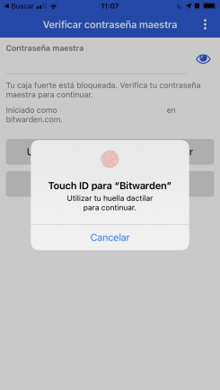
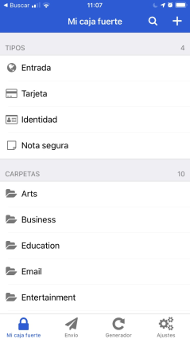
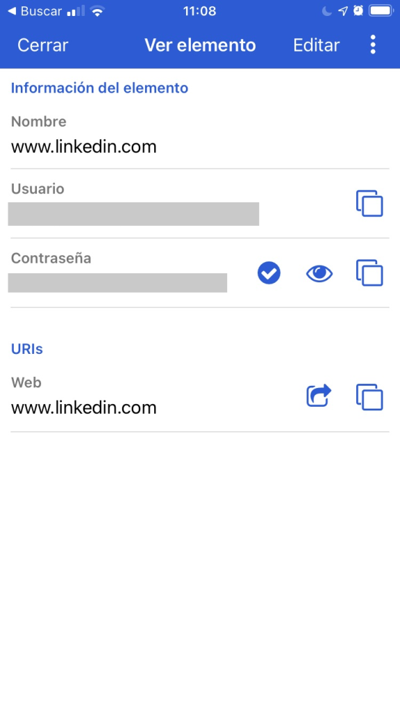
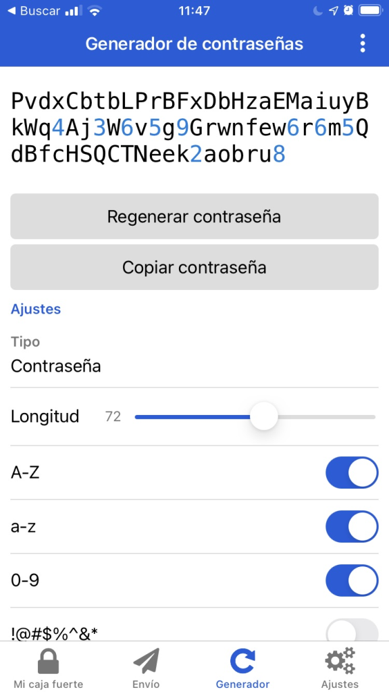
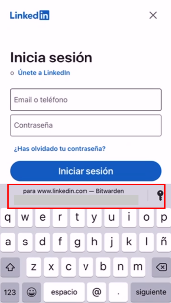
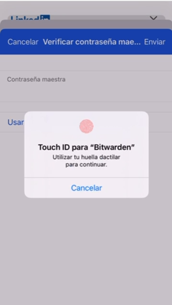

# Protección online: gestores de contraseñas.

Hoy en día, nuestra vida digital está cada vez más unida al mundo real: **toda huella digital tiene consecuencias cada vez más directas en el mundo real**, y viceversa. Este principio se aplica a la también a la seguridad: un ataque a cualquiera de nuestras cuentas puede repercutir seriamente en nuestro día a día, sobre todo considerando que los bancos, compras online, e incluso nuestras identidades dependen cada vez más del mundo digital. Por ello, conviene proteger nuestras cuentas e información online con algo más que una simple contraseña fácil de averiguar. Para ello existen herramientas como los gestores de contraseñas, pequeños programas que nos facilitan el proceso de hacer nuestras cuentas online lo más seguras posible. Pero, ¿qué son exactamente los gestores de contraseñas?

Pongámonos en contexto. Imaginemos que somos un usuario de Internet que, como la mayoría de usuarios de Internet, tiene cuentas en múltiples plataformas online como redes sociales, correo electrónico, foros… Imaginemos también que estamos utilizando **la misma contraseña** para todos esto sitios web. En un primer vistazo, esta opción parece la más cómoda, ya que cuando tengamos que iniciar sesión en estos sitios, nos bastará con recordar una única contraseña. No obstante, para los **ciberdelincuentes** esta situación es **óptima**. 

Si la contraseña utilizada es fácil de adivinar o es común, los atacantes serán capaces de adivinarla mediante varios métodos, y como ha sido utilizada en varios sitios web, los atacantes tendrán acceso a los mismos habiendo adivinado **una única contraseña**. También hay ocasiones en las que los atacantes ni siquiera necesitan adivinar contraseñas. En numerosos casos, **se han filtrado bases de datos** de plataformas online con datos sobre sus usuarios, entre los cuales se incluyen credenciales de acceso a las mismas. Lo primero que suelen hacer los atacantes al obtener estas bases de datos es comprobar si las contraseñas incluidas en las mismas están siendo usadas en otros sitios web; si nuestras credenciales están en dicha base de datos y utilizamos la misma contraseña para todo, nos podemos hacer una idea de lo que puede pasar.

_¿Entonces, debo recordar una contraseña distinta para cada sitio web en el que me cree una cuenta?_ Por suerte no: para ese fin existen los gestores de contraseñas.

Un gestor de contraseñas es una herramienta capaz de **generar y guardar** todas nuestras contraseñas y datos confidenciales en una bóveda segura protegida por una contraseña maestra y en la mayoría de los casos, seguridad biométrica (reconocimiento facial, huella dactilar, etc). A la hora de crear una cuenta, nuestro gestor de contraseñas es capaz de **generar contraseñas seguras** (normalmente, más de 60 caracteres aleatorios con letras, números y símbolos), y guardarlas junto a nuestro usuario en la ya mencionada bóveda segura. Estas contraseñas, al ser complejas y grandes, son muy difíciles de descifrar y complican el trabajo de los ciberdelincuentes, pudiendo llegar incluso a imposibilitarlo. 

Cuando se quiera iniciar sesión en un sitio web, el gestor **autocompletará** nuestro usuario y contraseña una vez ha verificado que, en efecto, es el usuario real el que quiere iniciar sesión. Para demostrar su validez, el usuario deberá proporcionar su contraseña maestra (la única que se tiene que memorizar), o superar la prueba de seguridad biométrica que tenga configurada (reconocimiento facial, huella dactilar…).

Los gestores de contraseñas se pueden instalar en un amplio rango de dispositivos: cuentan con **programas** para PC y Mac, **extensiones para navegadores** como Chrome, Edge, Opera y Firefox, así como **aplicaciones móviles** para Android e iOS. La instalación y configuración difiere entre plataformas, pero su funcionamiento es idéntico: se pueden generar y guardar contraseñas seguras, y cuando se quieran utilizar el usuario introduce su contraseña maestra o biometría configurada y el gestor autocompleta los campos de usuario y contraseña en el sitio que lo requiera.

Algunos ejemplos de gestores de contraseñas excelentes son Bitwarden, LastPass y 1Password, entre otros. El primero es gratuito, mientras que los dos últimos presentan una modalidad de pago por subscripción. A continuación, os mostraré cómo funciona Bitwarden, el gestor que yo utilizo.

Al abrir la aplicación para iOS, Bitwarden nos pide una contraseña o seguridad biométrica. En mi caso, lo tengo configurado con Touch ID (huella dactilar). En caso de que no pudiese utilizar mi huella dactilar o no fuese detectada correctamente por mi iPhone, podría utilizar mi contraseña maestra, como se puede ver tras el mensaje de Touch ID.

Una vez accedemos a la aplicación, nos encontramos con la ya mencionada caja fuerte o bóveda segura. En ella, tenemos acceso a todos nuestros datos confidenciales, pudiendo modificarlos, generar contraseñas nuevas, eliminar los ya existentes…

A la hora de iniciar sesión en aplicaciones o sitios web, el proceso es sencillo. Basta con dirigirnos al sitio en el que queramos iniciar sesión, y nuestro gestor de contraseñas autocompletará nuestro usuario y contraseña tras pedirnos la contraseña maestra o seguridad biométrica:

Cada vez que creemos una cuenta, el gestor lo detectará y sugerirá crear una contraseña y guardarla en la caja fuerte. Además, también es capaz de detectar cambios de contraseñas en cuentas ya existentes, ofreciendo a su vez la posibilidad de actualizarlas en la caja fuerte.

Como ya se ha mencionado anteriormente, este tipo de gestores está disponible en un amplio rango de dispositivos y navegadores web; su funcionamiento es exactamente el mismo en todos ellos. Personalmente, utilizo Bitwarden en mis dispositivos móviles y navegador web, y no he tenido ningún problema hasta la fecha.

En definitiva, usar un gestor de contraseñas es una muy buena práctica de cara a protegernos frente a ciberdelincuentes que puedan robar nuestra información de inicio de sesión, ya que dificultamos considerablemente su labor. Si bien el proceso de transición a un gestor de contraseñas puede ser algo tedioso y pesado al principio, cuando nos acostumbramos a utilizarlo todo es más fácil, rápido y seguro. 

Además, si combinamos un gestor de contraseñas con la página web Have I Been Pwned?, que nos permite conocer si nuestros datos de inicio de sesión han sido comprometidos, definitivamente no seremos un blanco fácil para los ciberdelincuentes.

¡Espero que este post haya servido de ayuda!