# Resolviendo Hack The Box: Explore.

En este artículo, explicaré el proceso que seguí para superar uno de los retos de la plataforma Hack The Box llamado Explore. El reto en cuestión consiste en obtener acceso root a un dispositivo Android simulado, para poder explorar directorios y archivos a los que sólo root tiene acceso.

### Paso I: ¿A qué me enfrento?

Una vez me conecté a la VPN de Hack The Box y habiendo iniciado una instancia de Explore, me puse manos a la obra. Antes de empezar a lanzar ataques y pensar en estrategias de acceso a la máquina objetivo, es preciso analizar dicho objetivo: para ello, utilicé la famosa herramienta de mapeo de puertos nmap.

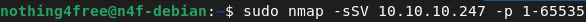

Mediante este comando, realicé un escaneo TCP SYN con detección de servicios y aplicaciones a todos los puertos del servidor, desde el 1 hasta el 65535. La salida de este escaneo es la siguiente:

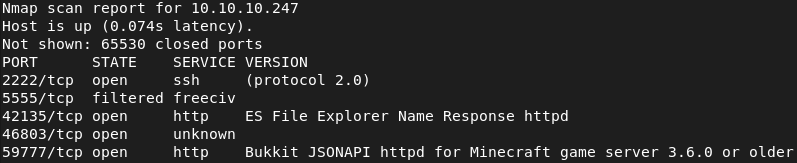

Determiné que los puertos de interés en esta fase eran dos: 2222/tcp (servidor SSH) y 42135/tcp (servidor HTTP levantado por ES File Explorer).

Llegado a este punto, tenía dos opciones: o bien hacía fuerza bruta al servidor SSH, o bien intentaba explotar de alguna forma el servidor de ES File Explorer. El primer tipo de ataque me podría llevar mucho tiempo y tendría que tener cierta suerte para dar no sólo con la contraseña, sino también con el usuario del servidor, así que me decanté por la segunda opción y decidí buscar vulnerabilidades en el servidor web.

### Paso II: explorando los vectores de ataque y obteniendo acceso al objetivo.

Usando SearchSploit, una herramienta desarrollada por Exploit Database, pude encontrar un exploit para el servidor levantado por ES File Explorer que permite ver y descargar cualquier archivo del dispositivo Android sin necesidad de autenticación. Dicho exploit se aprovecha de la vulnerabilidad [CVE-2019-6447](https://nvd.nist.gov/vuln/detail/CVE-2019-6477).

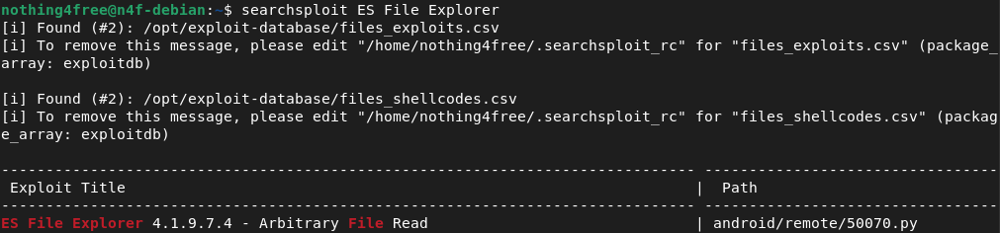

Me descargué el [exploit](https://www.exploit-db.com/exploits/50070) de la página Exploit Database y empecé a explorar los archivos que había en el dispositivo. Para ello, usé el comando listFiles del exploit:

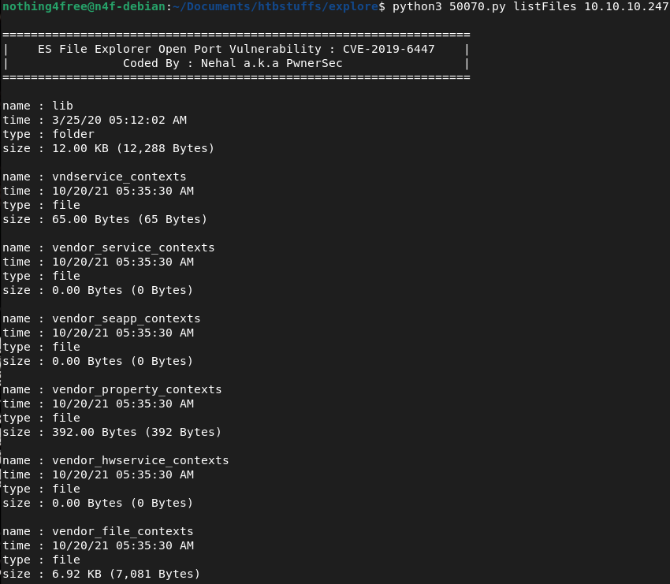

Si bien es interesante listar los archivos del dispositivo, no era del todo útil para mi finalidad. Por suerte, el desarrollador del exploit incluyó funcionalidades para listar archivos por tipo, así que lo siguiente que hice fue listar todas las imágenes de la máquina:

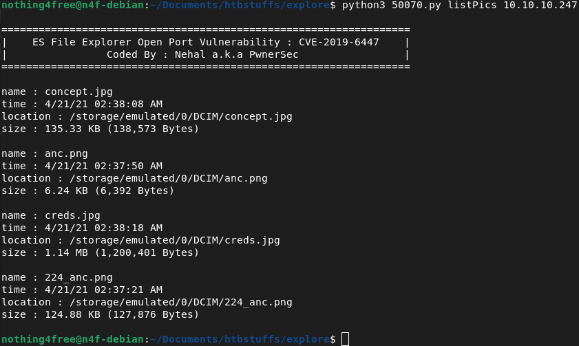

Contando con un rango mucho menor de archivos, descubrí que uno de ellos tenía un nombre muy llamativo: creds.jpg. Usando la misma herramienta, lo descargué en mi ordenador.

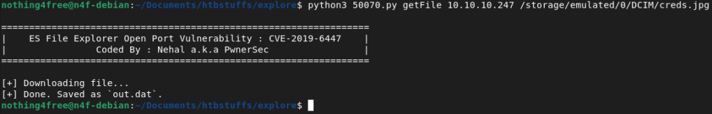

Navegué al directorio en el que se guardó, abrí el archivo y vi lo siguiente:

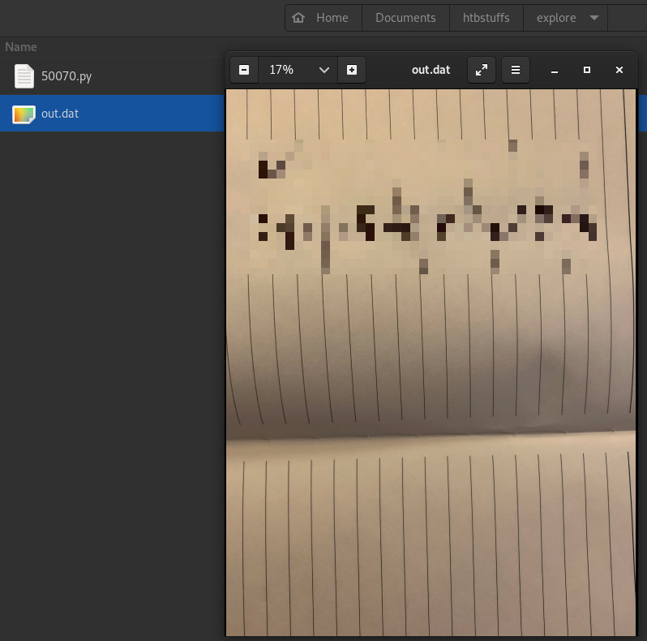

Aparentemente, en la imagen aparecían manuscritas unas credenciales de acceso: un usuario y su contraseña. Volviendo al paso I, recordé que este dispositivo también tenía un servidor SSH levantado, así que probé estas credenciales en el mismo.

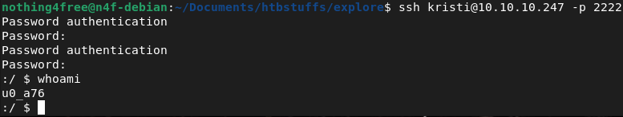

¡Bingo! En ese momento ya estaba dentro del dispositivo como el usuario u0_a76. Comprobé si este usuario tenía privilegios root, pero como era de esperar, no los tenía. Aún así, decidí explorar el sistema por mi cuenta, en busca de algo que me ayudase a continuar con el reto.

### Paso III: obteniendo la User Flag.

Dado que estaba en el directorio raíz, decidí hacer un ls para listar todos los directorios y archivos del mismo, para ver por donde podría seguir o si había algo fuera de lo normal. Esta es la salida del comando ls:

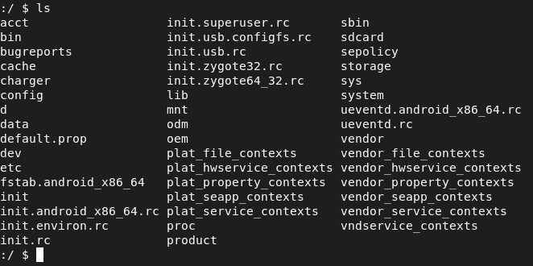

Antes de ponerme a examinar ficheros y directorios de sistema, decidí echar un vistazo al directorio sdcard.

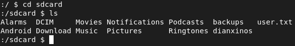

¡Bingo! ¡Hay un archivo llamado user.txt! Procedí a ver su contenido y, efectivamente, era la User Flag necesaria para superar la primera mitad del reto.

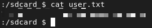

¡Primera fase superada! Ahora quedaba la parte más complicada: obtener acceso root al dispositivo.

### Paso IV: Explotando ADB

Investigué varias formas de realizar escalada de privilegios con el usuario al que tenía acceso, pero acabé decantándome por algo más simple. Mi experiencia como adolescente frustrado porque Samsung no quería actualizar mi móvil a Android Lollipop, y alguna que otra búsqueda en Google, me recordaron la existencia de ADB (Android Debug Bridge), una herramienta que permite el control de un sistema Android por comandos, pues permite acceso a una shell Unix. En su día usé ADB para rootear e instalar ROMs personalizadas en mi móvil, pero en este reto lo iba a usar para obtener una shell como root, así que me puse manos a la obra.

Lo primero que hice fue instalar adb en mi máquina Debian:

Una vez ya se instaló investigué sobre ADB y, como era de esperar, sólo es accesible desde localhost. En un principio esto era un problema, pero en mi caso ya tenía acceso SSH al dispositivo, por lo que podía redirigir el puerto 5555 a mi máquina. De esta forma, obtendría acceso a ADB y, en un principio, a una shell como root. Para hacerlo, cerré la conexión SSH que ya tenía y la volví a abrir especificando la siguiente configuración:

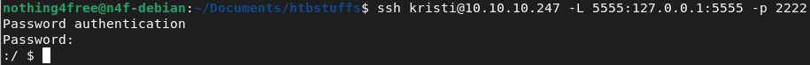

¡Perfecto! Al abrir otra terminal pude ver que, en efecto, el dispositivo Android era detectado por adb, por lo que me faltaba únicamente obtener la shell como root. Para ello, me conecté al dispositivo Android, reinicié el daemon adbd para que se ejecutase como root, y obtuve la shell.

Primero, me conecté por ADB al dispositivo Android...

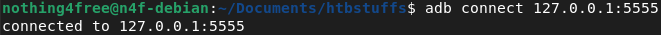

A continuación, reinicié el demonio adbd como root…

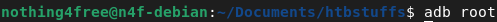

... y por último, invoqué una shell.

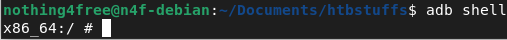

Ahora tenía una shell abierta desde ADB. Pero, ¿era root? Un simple whoami me lo confirmó: ¡tenía acceso root al dispositivo!

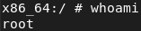

Resolver el reto final era cuestión de explorar aquellas partes del dispositivo que antes no podía como usuario estándar. Tras varios minutos de hacer cd’s y ls’s, obtuve la flag de root y la envíe a Hack The Box: ¡Había superado mi primer reto en la plataforma!

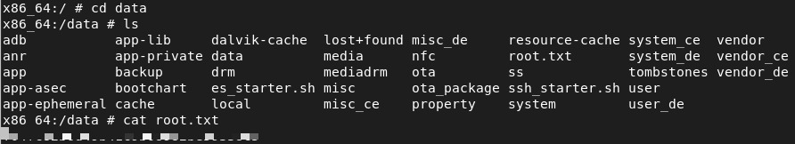

### Conclusión

Explore es un reto bastante bueno para principiantes como yo. Combina habilidades básicas de Linux, invita a buscar y usar exploits ya existentes y también abarca todo el tema de ADB, al tratarse de una máquina Android. Me ha parecido un reto muy entretenido, y volver a usar ADB me ha llevado unos cuantos años atrás, cuando me dedicaba a instalar ROMs en mi primer smartphone.

Este es el primer reto que he superado en Hack The Box. Años atrás intenté superar alguno más, pero simplemente no tenía el conocimiento y práctica necesarios para ello. En cambio esta vez fue distinto, ya que supe qué pasos seguir y qué herramientas y técnicas usar. No voy a mentir: cuando conseguí acceso root empecé a dar saltitos en mi silla, cual niño entusiasmado porque le van a dar una piruleta. Me entretuve mucho luchando con este reto, y me ha hecho mucha ilusión superarlo. ¡Espero que sea el primero de muchos más!

¡Muchas gracias por leerme, y hasta la próxima!