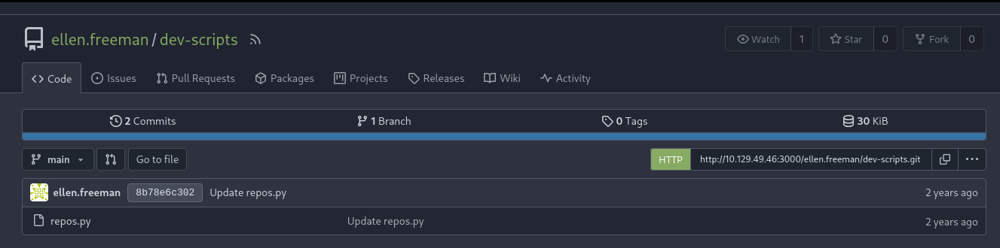
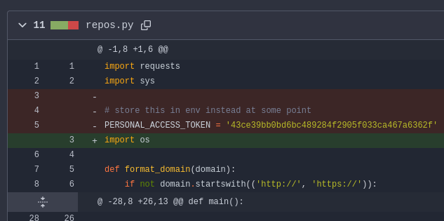
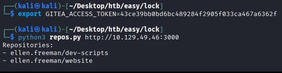
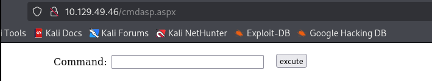
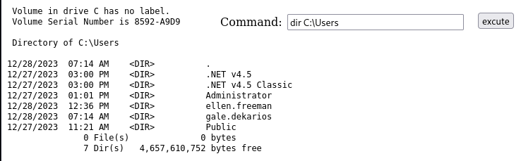
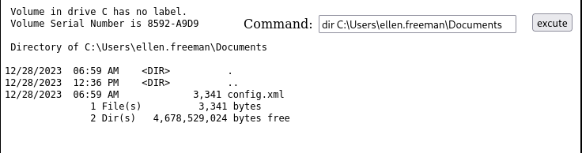
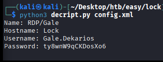
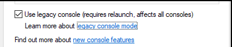
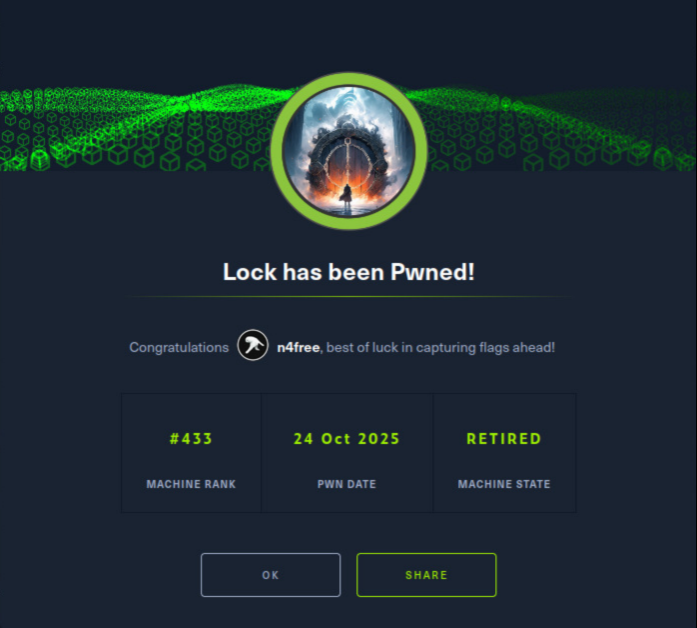

Comenzamos escaneando la IP destino: `nmap 10.179.49.46 -sV --open -T5 -oN ports -Pn` 

Encontramos los siguientes puertos abiertos:
- 80/tcp -> web "corporativa".
- 445/tcp -> SMB
- 3000/tcp -> web del servicio Gitea
- 3389/tcp -> RDP (Windows)

Además del spoiler que hace Hack the Box acerca del SO, encontramos una confirmación de que estamos ante un Windows en los banners detectados.

---
### Parte 1 - Gitea

La web corporativa no es de interés (de momento). Vamos al Gitea y vemos que hay un repo público, ellen.freeman/dev-scripts:

Viendo la historia de commits, observamos que el primer commit contiene un token de Git del usuario:

Analizando el script, es una pequeña tool para sacar los repos de un usuario. Lee la clave del usuario de la variable de entorno "GITEA_ACCESS_TOKEN", por lo que la seteamos al valor que encontramos y ejecutamos el script, lo que nos desvela que existe otro repo adicional:

Con el token y el usuario, clonamos el repo. Es la página web corporativa (puerto 80). El readme nos da una pista:

¡Eso no es muy 27001 por tu parte, colegui! Anyways.

### Parte 2 - Webshell

Sabiendo que andamos en terreno MS (y que el server web del puerto 80 es IIS), cogemos la webshell de /usr/share/webshells/aspx y la incluimos en el repo. Hacemos git add, git commit y git push y, por arte de magia (o de mecanismos dudosos), desplegamos la webshell en el servidor:

Haciendo dirs vemos que hay más usuarios:

Echando un ojo a los docus de ellen.freeman, vemos cosas interesantes:

Este documento es un fichero de configuración de conexión de mRemoteNG. Lo visualizamos y guardamos, y vemos que las credenciales están cifradas parcialmente. Se pueden romper con el script https://github.com/gquere/mRemoteNG_password_decrypt (resultado de buscar "crack mremoteng xml").

### Parte 3 - RDP

Vamos a entrar por la puerta grande: RDP. La flag de usuario está en el escritorio, nada raro.

Los únicos programas que la máquina tiene instalados son PDF24 y Firefox. Buscando sobre el primero, vemos que es potencialmente vulnerable a CVE-2023-49147 (https://packetstorm.news/files/id/176206). Básicamente, hay que llamar al MSI del instalador `(C://_install)` y aplicar Oplocks al fichero de log al que referencia el CVE.

Los oplocks se pueden aplicar mediante SetOpLock.exe (véase: https://github.com/googleprojectzero/symboliclink-testing-tools/tree/main). Para pasar el fichero, simplemente descargamos el ejecutable del repo, descomprimimos y especificamos la ruta a la carpeta compartida que será montada como un drive en red mediante xfreerdp:

`xfreerdp /u:user /p:pass /drive:NombreDrive,/ruta/a/la/carpeta`

Ejecutamos SetOpLock.exe:
`SetOpLock.exe C:\Program Files\PDF24\faxPrnInst.log`

Ejecutamos MSI:
`msiexec /fa C:\_install\pdf24-creator-11.15-x64.msi`

La shell que spawnea al final del proceso se quedará fija debido al oplock; la gracia es que está spawneada como SYSTEM. Click derecho en barra superior > Properties y habilitamos legacy mode, pulsando también sobre el link:
![[Pasted image 20251025015702.png]]

Se abre un navegador (que no debe ser ni IE ni Edge -- mágicamente tenemos Firefox. Gracias, Firefox.). CTRL-O, "descargamos" cmd.exe y lo abrimos (¡como SYSTEM!) desde el navegador.

Siendo admin... encontrar el flag es trivial :)

---

He de decir que me ha costado un ratete encontrar la forma de romper el fichero de credenciales mRemoteNG. Buscar en Google... a veces ayuda, jejeje.

Más allá de eso, me parece una máquina muy buena para ir practicando y cogiendo ritmo. Diría que está en la parte Easy más cercana al Medium. Asequible, pero lleva un ratete :)

¡Ánimo con esas máquinas!

